# Fast-Track of F-18 Positron Paths Simulations Using GANs

This repository contains the code and the trained generators for this paper:

> Y. Mellak, K. Chatzipapas, A. Bousse, C. Chez-Le Rest, D. Visvikis, J. Bert.
> *Fast-Track of F-18 Positron Paths Simulations Using GANs.*
> IEEE International Symposium on Biomedical Imaging (ISBI), 2024.

| | Link |
|---|---|
| Published paper (IEEE) | [doi.org/10.1109/ISBI56570.2024.10635834](https://doi.org/10.1109/ISBI56570.2024.10635834) |
| arXiv | [arxiv.org/abs/2403.06307](https://arxiv.org/abs/2403.06307) |
| Code | [github.com/Mellak/Particles_Tracking_GAN](https://github.com/Mellak/Particles_Tracking_GAN) (this repository) |
| PhD thesis (Chapter 4, Section 1) | [theses.hal.science/tel-05465688](https://theses.hal.science/tel-05465688) |
| Next work: DDConv | [Paper](https://doi.org/10.1109/TRPMS.2025.3647264), [arXiv](https://arxiv.org/abs/2503.00587), [code](https://github.com/Mellak/ddconv-prc) |

The PhD thesis of Y. Mellak also describes this method and adds extensions.
In this README, "the thesis" refers to Chapter 4, Section 1 of the
[thesis](https://theses.hal.science/tel-05465688).

<p align="center">
  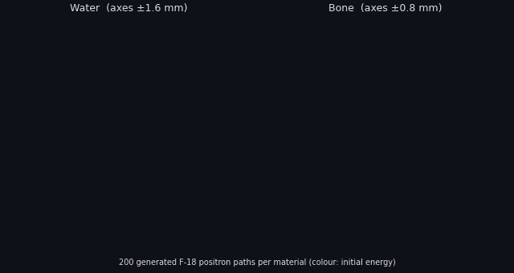
</p>
<p align="center"><em>
200 generated F-18 positron paths in water and 200 in bone.
The released generators made these paths on a CPU, with the demo conditions (see "Generate paths").
The script <code>scripts/make_animation.py</code> makes this animation.
</em></p>

## Motivation

Monte Carlo (MC) simulation is the reference method to model the transport of positrons in PET.
MC simulation follows each positron step by step until the annihilation.
This particle tracking takes much time.
Thus, it is difficult to use MC simulation when you must simulate many events quickly.

This repository examines a different method.
A generative neural network makes the full path of a positron in a homogeneous material.
Each path gives the 3D position and the remaining kinetic energy at each interaction.
To get the annihilation distribution, put the end points of the paths into a voxel grid.

## Method

A positron path is a matrix with `N` rows, one row for each interaction.
Each row has four values: the remaining kinetic energy and the position (x, y, z).
Each path starts at the origin.
The energy decreases along the path. The energy is zero at the last interaction.

- **Generator** (`GeneratorNumIntEnergyDirection2` in `src/models.py`).
  The generator is a transformer encoder.
  Its input is a random vector from N(0, 1), with 100 values.
  The generator adds the embedded number of interactions, a mask, the initial energy and the initial direction to this vector.
  The mask is zero after the last interaction.
  A linear layer changes this input into a sequence.
  The transformer encoder makes one embedding for each point of the sequence.
  A 1x1 convolution changes each embedding into the four data values.
- **Discriminator** (`ViTwMask2` in `src/models.py`).
  The discriminator is a binary classifier, similar to a Vision Transformer (ViT).
  Each point of the path is one patch.
  The discriminator also receives the embedded initial energy and number of interactions.
  It ignores the padding after the last interaction.
- **Conditions.** The generator uses three conditions: the initial energy, the number of interactions and the initial direction.
  The number of interactions sets the length of the path. For F-18, this length is from 3 to 18.
- **Loss.** The training uses the least-squares GAN loss, with two more terms:
  - A cosine term compares the direction of the first segment of the path with the necessary direction.
    This term lets you control the initial direction of the positron.
  - Two energy terms add a penalty when the energy is negative or when the energy increases along the path.
    The weight of these terms is 0.005.

  Refer to `scripts/train.py`.
- **Training data.** GATE MC simulations supplied the training data.
  A point source is at the origin, in a sphere with a radius of 50 cm.
  The simulations use the F-18 energy spectrum in water, lung and bone, with approximately 10,000 events for each material.
  A phase-space actor records each step of each positron.
  At each epoch, random rotations change the paths (refer to `src/dataloader.py`).
  This repository does not contain the GATE data.

<p align="center">
  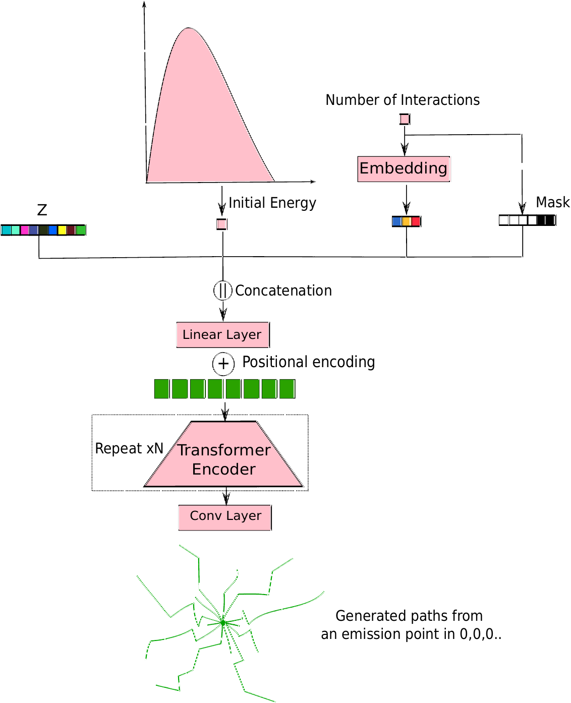
  &nbsp;&nbsp;&nbsp;
  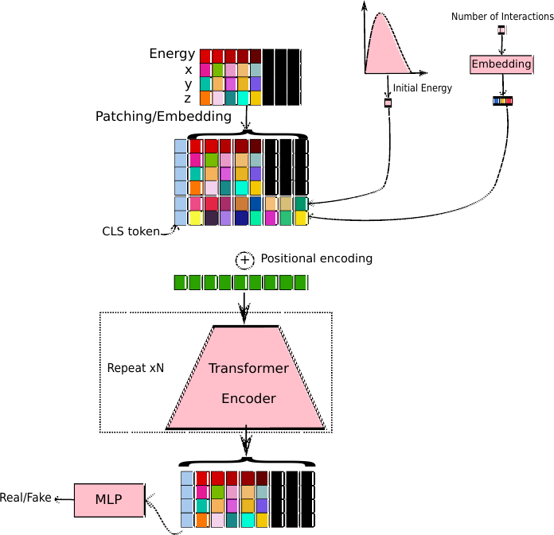
</p>
<p align="center"><em>
Left: the generator. Right: the discriminator.
Figures from Y. Mellak, <a href="https://theses.hal.science/tel-05465688">PhD thesis</a>, Chapter 4, Section 1.
</em></p>

## Install

Do these steps:

```bash
git clone https://github.com/Mellak/Particles_Tracking_GAN.git
cd Particles_Tracking_GAN
pip install -r requirements.txt
```

The released generators operate on a CPU or on a GPU.

## Repository layout

```
src/        models.py, dataloader.py, utils.py, sampling.py
scripts/    train.py, generate.py, make_animation.py
notebooks/  Inference.ipynb
weights/    G_F18_Water.pth, G_F18_RibBone.pth, G_F18_Lung.pth
figures/
```

## Train

To train a model, you must have GATE phase-space files.
The name of each file is `positrons_<k>.npy`.
Each file contains an array with the shape `(events, steps, 4)`.
Each row is `(energy [MeV], x [mm], y [mm], z [mm])`.
After the last interaction, the rows are zero. Each event must have at least one row of zeros.

To start the training, use this command:

```bash
python scripts/train.py --data-dir /path/to/WaterF18 --material Water --emitter F18 --output-dir runs
```

The default values are the same as in the original script:

- Batch size: 30.
- Learning rate: 1e-4 for the generator and 3e-4 for the discriminator (Adam).
- Number of epochs: 10,000.
- Files: `positrons_<k>.npy` with `0 < k < 20`.

The script writes the checkpoints, the generator weights of each epoch and the diagnostic figures in `runs/<emitter>/<material>/`.
If a checkpoint is available, the training continues from that checkpoint.
To see all the options, use `python scripts/train.py --help`.

## Generate paths

To generate paths with the released F-18 weights, use this command:

```bash
python scripts/generate.py --material Water --num-paths 20000 --output water_paths.npz
```

The value of `--material` is `Water`, `RibBone` or `Lung`.
The output `.npz` file contains `paths`, with the shape `(events, 18, 4)`, and the conditions.
The columns of `paths` are energy (MeV), x, y and z (mm).
The script also shows R_mean and R_max of the end points.

The generator needs three conditions: the initial energy, the number of interactions and the direction.
There are two sources for these conditions:

- **GATE data** (`--data-dir /path/to/WaterF18`).
  The script uses the conditions of the GATE events.
  It also loads the GATE paths, for a comparison.
  The paper and the thesis use this procedure.
- **Demo conditions** (default).
  The script uses an analytic F-18 beta+ spectrum, isotropic directions and a simple rule that gives the number of interactions from the energy (`src/sampling.py`).
  In the paper and the thesis, a histogram from the GATE data gives the number of interactions.
  This repository does not contain this histogram.
  The simple rule has two coefficients for each material.
  We tuned these coefficients to get R_mean and R_max near the F-18 values in the Results table.
  Thus, the demo conditions do not give an independent check of the generators.
  For a quantitative comparison, use `--data-dir` (refer to "Limitations").

The notebook `notebooks/Inference.ipynb` is the original inference notebook, updated for the new layout.
The notebook also needs GATE data.

## Results

The values in this section come from the thesis. GATE is the reference.
R_mean is the mean radius of the end points of the paths. R_max is the maximum radius.

| Material | | F-18 R_mean | F-18 R_max | Ga-68 R_mean | Ga-68 R_max |
|---|---|---|---|---|---|
| Water | GATE | 0.52 mm | 2.13 mm | 2.39 mm | 11.15 mm |
| | GAN | 0.52 mm | 2.02 mm | 2.37 mm | 11.07 mm |
| Bone | GATE | 0.25 mm | 1.07 mm | 1.28 mm | 4.78 mm |
| | GAN | 0.26 mm | 0.94 mm | 1.26 mm | 4.26 mm |
| Lung | GATE | 1.92 mm | 7.82 mm | 9.00 mm | 34.51 mm |
| | GAN | 1.93 mm | 7.60 mm | 8.22 mm | 29.24 mm |

- R_mean of the GAN is very near to R_mean of GATE.
- R_max shows the tail of the distribution. The difference in R_max is less than 13% for all materials and the two isotopes.
  For F-18, the maximum difference is 12%, in bone.
- For the three materials, the 1D point spread functions (PSFs) of the GAN are very near to the PSFs of GATE.
- The Ga-68 values come from the thesis. This repository does not contain the Ga-68 weights (refer to "Thesis extensions").

**1D PSFs.** The figures below show the distribution of the end points along x, y and z.
All paths start at the origin. "Real Points" (green) are GATE. "Fake Points" (red) are the GAN.

<p align="center"><strong>Water</strong> &nbsp;(left: F-18, right: Ga-68)</p>
<p align="center">
  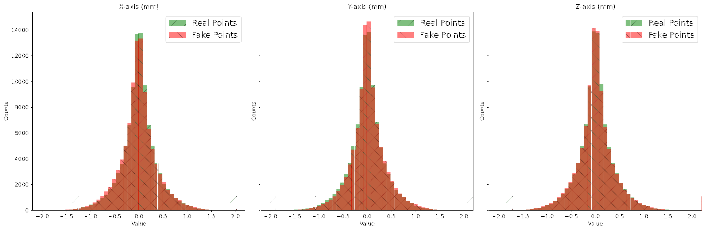
  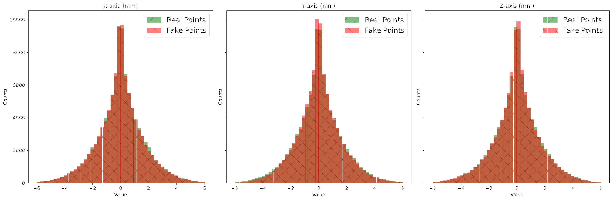
</p>
<p align="center"><strong>Lung</strong> &nbsp;(left: F-18, right: Ga-68)</p>
<p align="center">
  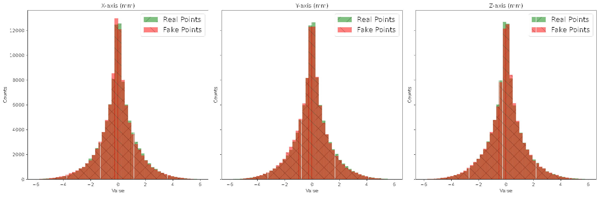
  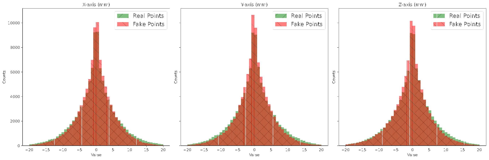
</p>
<p align="center"><strong>Bone</strong> &nbsp;(left: F-18, right: Ga-68)</p>
<p align="center">
  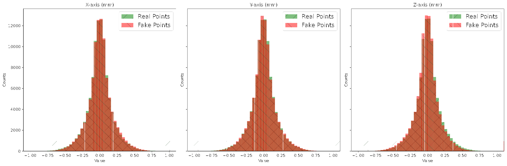
  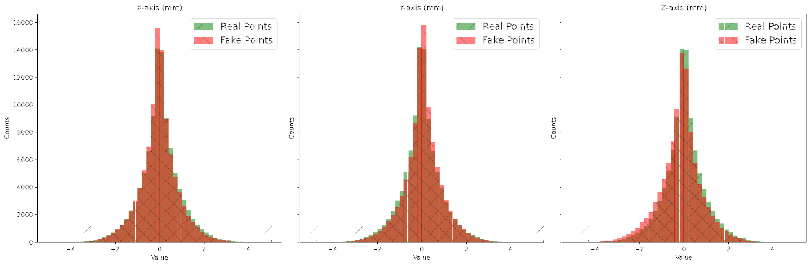
</p>
<p align="center"><em>
PSFs for F-18 and Ga-68 in water, lung and bone, along the x, y and z axes.
This repository contains the F-18 weights only.
Figures from Y. Mellak, <a href="https://theses.hal.science/tel-05465688">PhD thesis</a>, Chapter 4, Section 1.
</em></p>

**Speed.** The paper gives these values:

- The GAN generates 20,000 paths in approximately 6 s, with one batch of 20,000 events.
- GATE needs approximately 45 s for the same simulation (three point sources of 0.2 MBq in spheres with a radius of 5 cm).

The thesis does not give this comparison again.
These times change with the hardware and with the GATE configuration (physics list, cuts).
We did not measure these times again for this README.
Each generator is small (approximately 1 MB of weights) and can generate large batches in one operation.

## Limitations

The thesis gives these limitations. Some items are specific to this repository.

- You must train one model for each radionuclide and for each material.
  The energy spectrum and the number of interactions change with the radionuclide and the material.
- The generator needs the number of interactions as an input.
  This number sets the length of the output and the padding.
  A histogram from the GATE data gives this number. This repository does not contain this histogram.
  At a boundary between two materials, the residual energy and the same histogram give the number of interactions for the remaining track.
  This approximation can cause discontinuities.
- In voxelized or heterogeneous GATE volumes, GATE adds many steps near the boundaries.
  A track can have hundreds of steps.
  Thus, it is difficult to train one consistent model on these data.
  For future work, the thesis proposes simplified MC tracks and an autoregressive model.
- The thesis also examined a diffusion training of the same generator, with 400 steps.
  This procedure does not need the number of interactions.
  But the time to generate the paths is 400 times longer.
- The boundaries between materials are the most sensitive areas.
  The models in this repository are for homogeneous materials only.

## Thesis extensions (not all in this repository)

Chapter 4 of the [thesis](https://theses.hal.science/tel-05465688) adds two extensions to the paper.

> **Important:** This repository contains only the F-18 generators for water, lung and bone.
> The items below are in the thesis. They are not in this repository.

**Ga-68.**
The thesis trains generators for Ga-68 in water, lung and bone.
Ga-68 positrons have a higher energy. Their paths have up to 30 interactions, not 18.
The training script accepts `--emitter Ga68` (30 steps), but we did not test this option.
This repository does not contain Ga-68 weights.
The Ga-68 values in the Results table come from the thesis.

**RGIMMT (recursive generation in heterogeneous materials).**
This procedure simulates positrons in a voxelized phantom with more than one material:

1. For each material, the activity gives the number of positrons.
2. The generator of the material generates each positron.
   The conditions are an energy from the spectrum of the isotope, a number of interactions from the histogram and an isotropic direction.
3. The procedure puts each path at an emission point in an active voxel.
4. If the path crosses a boundary between two materials, the procedure cuts the path at the boundary.
5. The procedure gets the position, the direction and the residual energy at the boundary.
   Then, the generator of the new material continues the track from this state.
6. The procedure repeats steps 4 and 5 until the track stops in one material.
   Then, it adds the end point to the annihilation volume.

The phantom of the thesis is a rod with four spheres, connected by a bridge.
The grid is 400x100x100 voxels of 1 mm³, with 20 million events, in bone, water and lung.
In this phantom, the direct GAN gives a positron range that is too large when the positron goes from lung into a denser material.
RGIMMT stays near GATE at all the transitions.

This repository does not contain these items:

- The RGIMMT code.
- The Ga-68 code and weights.
- The energy-to-interactions histograms.
- The heterogeneous phantom.

<p align="center">
  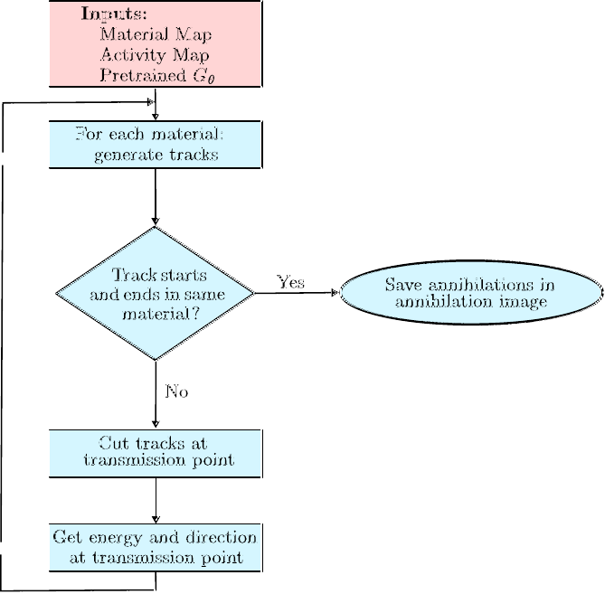
</p>
<p align="center"><em>
Simulation of positrons in a heterogeneous material with the GAN (RGIMMT).
Figure from Y. Mellak, <a href="https://theses.hal.science/tel-05465688">PhD thesis</a>, Chapter 4, Section 1.
</em></p>

<p align="center">
  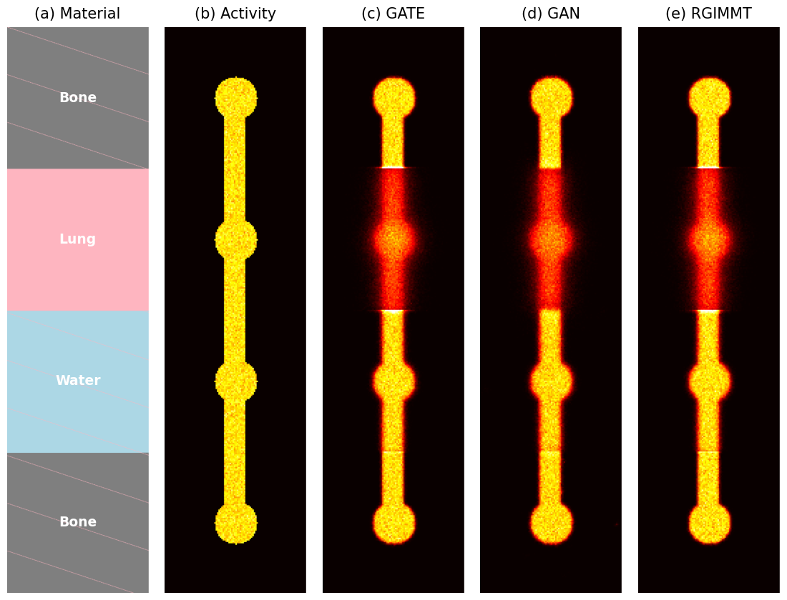
</p>
<p align="center"><em>
Simulation in heterogeneous materials, slice 50:
(a) material map, (b) activity, (c) GATE annihilations, (d) direct GAN annihilations, (e) RGIMMT annihilations.
Figure from Y. Mellak, <a href="https://theses.hal.science/tel-05465688">PhD thesis</a>, Chapter 4, Section 1 (panels put together for this README).
You cannot make this figure again with this repository.
</em></p>

## Why this led to DDConv

The first objective of this method was the correction of the positron range in PET image reconstruction.
The thesis gives two reasons why we did not use the method for this objective:

- **Time.** RGIMMT needs much computation in heterogeneous phantoms. One track can have hundreds of segments.
  A real PET scan has hundreds of millions of positrons. Thus, the time is too long.
- **No transpose.** Iterative reconstruction needs the transpose of the blur operator.
  It is not possible to calculate this transpose for a path-by-path simulation.

Thus, the thesis corrects the positron range at the image level, with learned spatial transformations.
The cost of this correction changes with the size of the image, not with the number of events.
This work is **DDConv** (Dual-Input Dynamic Convolution):

> Y. Mellak, A. Bousse, T. Merlin, É. Émond, M. Hakulinen, D. Visvikis.
> *Dual-Input Dynamic Convolution for Positron Range Correction in PET Image Reconstruction.*
> IEEE Transactions on Radiation and Plasma Medical Sciences, 2025.

DDConv uses a trained convolutional neural network (CNN) to find a local blurring kernel for each voxel.
The training uses voxel-specific positron range PSFs from MC simulations.
DDConv operates in an iterative reconstruction algorithm to correct the positron range.
It is applicable to high-energy emitters such as Ga-68, and to interfaces such as bone-soft tissue and lung-soft tissue.

- Published paper: [doi.org/10.1109/TRPMS.2025.3647264](https://doi.org/10.1109/TRPMS.2025.3647264)
- arXiv: [arxiv.org/abs/2503.00587](https://arxiv.org/abs/2503.00587)
- Code: [github.com/Mellak/ddconv-prc](https://github.com/Mellak/ddconv-prc)

## Citation

If you use this code, please cite the paper:

```bibtex
@inproceedings{mellak2024fasttrack,
  title     = {Fast-Track of {F-18} Positron Paths Simulations Using {GANs}},
  author    = {Mellak, Youness and Chatzipapas, Konstantinos and Bousse, Alexandre and
               Chez-Le Rest, Catherine and Visvikis, Dimitris and Bert, Julien},
  booktitle = {2024 IEEE International Symposium on Biomedical Imaging (ISBI)},
  year      = {2024},
  doi       = {10.1109/ISBI56570.2024.10635834},
  eprint    = {2403.06307},
  archivePrefix = {arXiv}
}
```

For the extensions (Ga-68, RGIMMT), cite the thesis:
[theses.hal.science/tel-05465688](https://theses.hal.science/tel-05465688).

For the image-level positron range correction, cite DDConv:

```bibtex
@article{mellak2025ddconv,
  title   = {Dual-Input Dynamic Convolution for Positron Range Correction in {PET} Image Reconstruction},
  author  = {Mellak, Youness and Bousse, Alexandre and Merlin, Thibaut and
             {\'E}mond, {\'E}lise and Hakulinen, Mikko and Visvikis, Dimitris},
  journal = {IEEE Transactions on Radiation and Plasma Medical Sciences},
  year    = {2025},
  doi     = {10.1109/TRPMS.2025.3647264},
  eprint  = {2503.00587},
  archivePrefix = {arXiv}
}
```

## License

MIT. Refer to [LICENSE](LICENSE).
